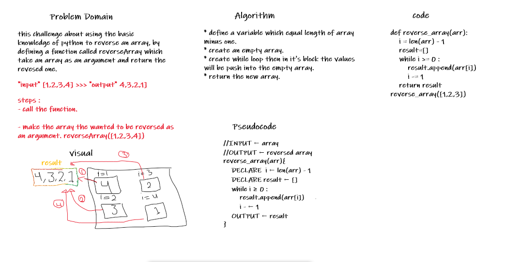
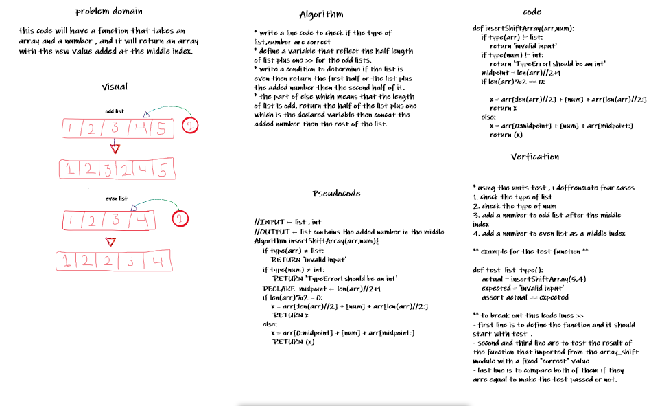
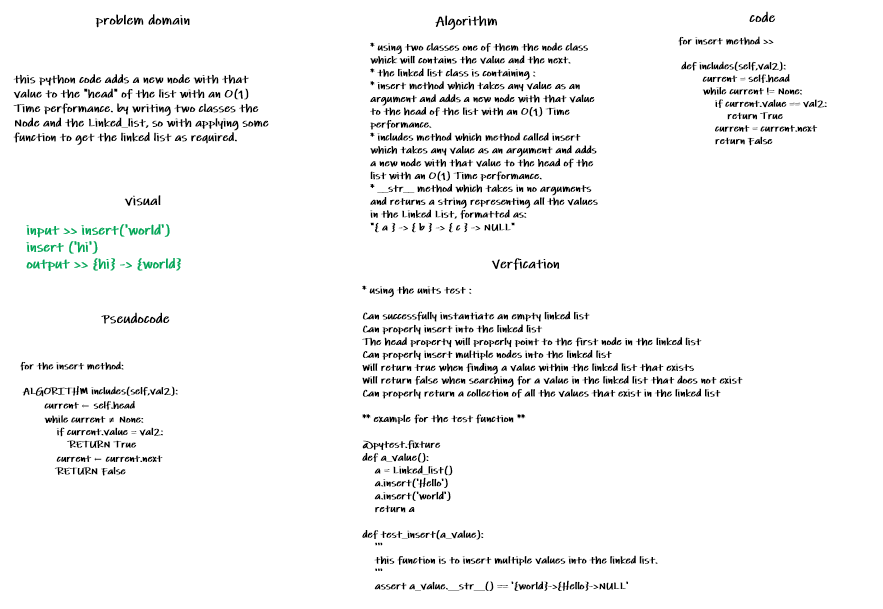
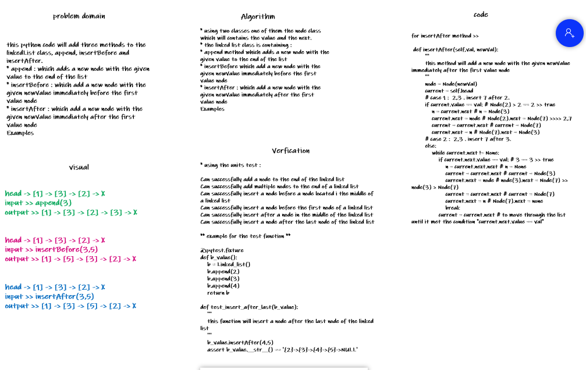
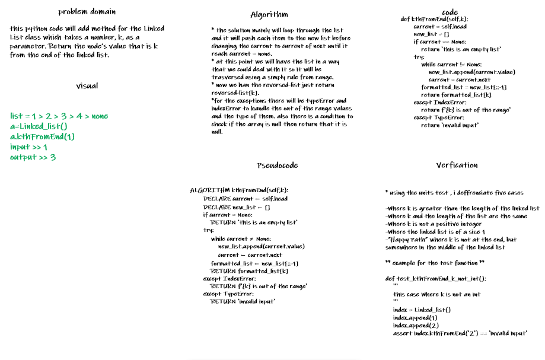

|challenge|pull request|
|---|---|
|challenge-1|https://github.com/farahzuot/data-structures-and-algorithms-python/pull/1|
|challenge-2|https://github.com/farahzuot/data-structures-and-algorithms-python/pull/2|
|challenge-2|https://github.com/farahzuot/data-structures-and-algorithms-python/pull/3|
|challenge-2|https://github.com/farahzuot/data-structures-and-algorithms-python/pull/4|

# Reverse an Array

this function will reverse the array

## Challenge Description

the challenge about using the basic knoledge of python to solve the problem.

## Approach & Efficiency
<!-- What approach did you take? Why? What is the Big O space/time for this approach? -->

## Solution

## Shift an array

this function will add number to the middle of the list as index

## Challenge Description

the challenge will add a given number to a given array at the middle of it , if the length of it is odd then it will be added after the middle element'.'

## Approach & Efficiency
<!-- What approach did you take? Why? What is the Big O space/time for this approach? -->

## Solution

## Linked-list

this python code adds a new node with that value to the "head" of the list with an O(1) Time performance.

## Challenge Description

writing two classes the Node and the Linked_list, so with applying some function to get the linked list as required.

## Approach & Efficiency
<!-- What approach did you take? Why? What is the Big O space/time for this approach? -->

## Solution

## Linked-list-part2

this python code will add three methods to the linkedList class, append, insertBefore and insertAfter

## Challenge Description

each method have some line codes to get the result as required, they will be describe further more in the whiteboard

## Approach & Efficiency
<!-- What approach did you take? Why? What is the Big O space/time for this approach? -->

## Solution

## Linked-list-part3

this python code will add method for the Linked List class which takes a number, k, as a parameter. Return the node’s value that is k from the end of the linked list.

## Challenge Description

the method called kthFromEnd, it is take in k which is the index from the end and return the value of that index.

## Approach & Efficiency
<!-- What approach did you take? Why? What is the Big O space/time for this approach? -->

## Solution

