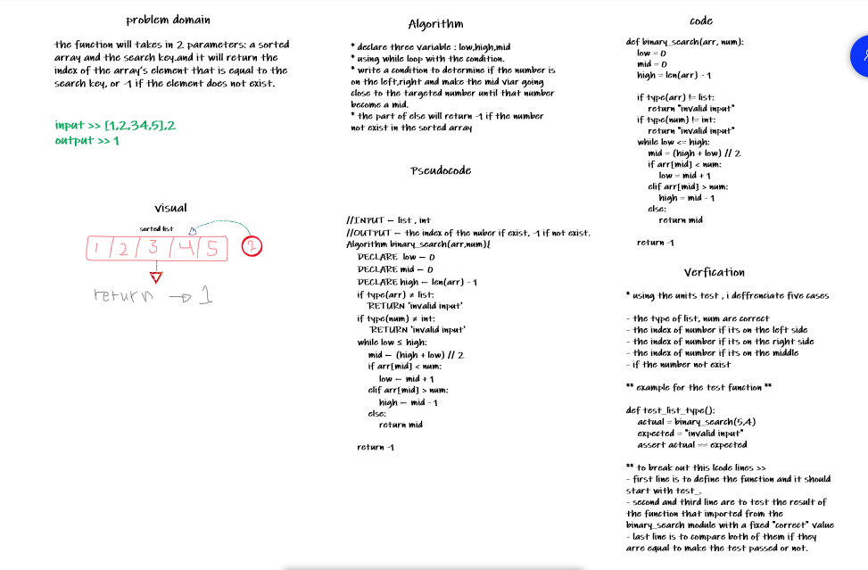

|challenge|pull request|
|---|---|
|challenge-1|https://github.com/farahzuot/data-structures-and-algorithms-python/pull/1|
|challenge-2|https://github.com/farahzuot/data-structures-and-algorithms-python/pull/2|

# Reverse an Array

## this function will reverse the array

## Challenge Description

## the challenge about using the basic knoledge of python to solve the problem.

## Approach & Efficiency
<!-- What approach did you take? Why? What is the Big O space/time for this approach? -->

## Solution

## Shift an array

## this function will add number to the middle of the list as index

## Challenge Description

## the challenge will add a given number to a given array at the middle of it , if the length of it is odd then it will be added after the middle element'.'

## Approach & Efficiency
<!-- What approach did you take? Why? What is the Big O space/time for this approach? -->

## Solution

## binary search

## this function will use the binary search method to find the index of certain number

## Challenge Description

## in this challenge the function will takes in 2 parameters: a sorted array and the search key.and it will return the index of the array’s element that is equal to the search key, or -1 if the element does not exist '.'

## Approach & Efficiency
<!-- What approach did you take? Why? What is the Big O space/time for this approach? -->

## Solution

