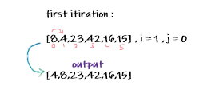
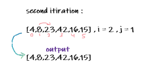
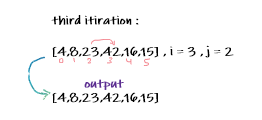
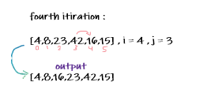
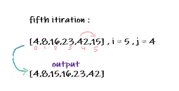

# Insertion Sort

  Pseudocode
    
    InsertionSort(int[] arr)
  
    FOR i = 1 to arr.length
    
      int j <-- i - 1
      int temp <-- arr[i]
      
      WHILE j >= 0 AND temp < arr[j]
        arr[j + 1] <-- arr[j]
        j <-- j - 1
        
      arr[j + 1] <-- temp

## itirations

> Sample array : [8,4,23,42,16,15]

first itiration

in the first itiration the i = 1 , j = 0. then it will start comaring the element with all previous ones to put it in the right place, so 4 comparing with 8. it is smaller so it will be placed in index 0. and 8 will be placed in the index 1.

second itiration 

in the second itiration the i = 2 , j = 1. then it will start comaring the element with all previous ones to put it in the right place, so 8 comparing with 23. the 23 larger than 8 so it will stay in the same index as will as 8 will stay in index 1.

third itiration 

in the third itiration the i = 3 , j = 2. then it will start comaring the element with all previous ones to put it in the right place, so 23 comparing with 42. the 42 larger than 23 so it will stay in the same index as will as 23 will stay in index 2.

fourth itiration

in the fourth itiration the i = 4 , j = 3. then it will start comaring the element with all previous ones to put it in the right place, so 42 comparing with 16. the 16 is smaller than 42 , and it smaller than 23 but its larger than 8 so it will be placed in index 2 and other elements will be shifted to the right.

fifth itiration 

in the fifth itiration the i = 5 , j = 4. then it will start comaring the element with all previous ones to put it in the right place, so 42 comparing with 15. the 15 is smaller than 42 , and it smaller than 23 and smaller than 16 but its larger than 8 so it will be placed in index 2 and other elements will be shifted to the right.

### Efficency

Time: O(n^2)

Space: O(1)
