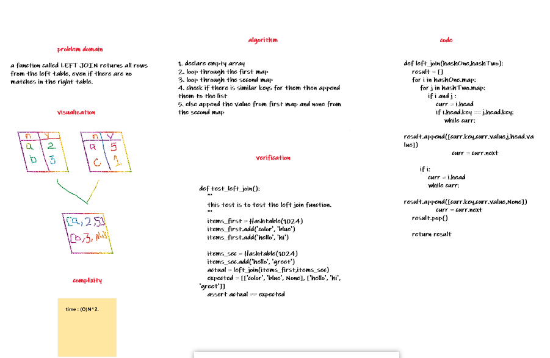

# Repeated word

 a function called LEFT JOIN returns all rows from the left table, even if there are no matches in the right table.

## Challenge Description

## Approach & Efficiency

O(N^2)

## Solution

