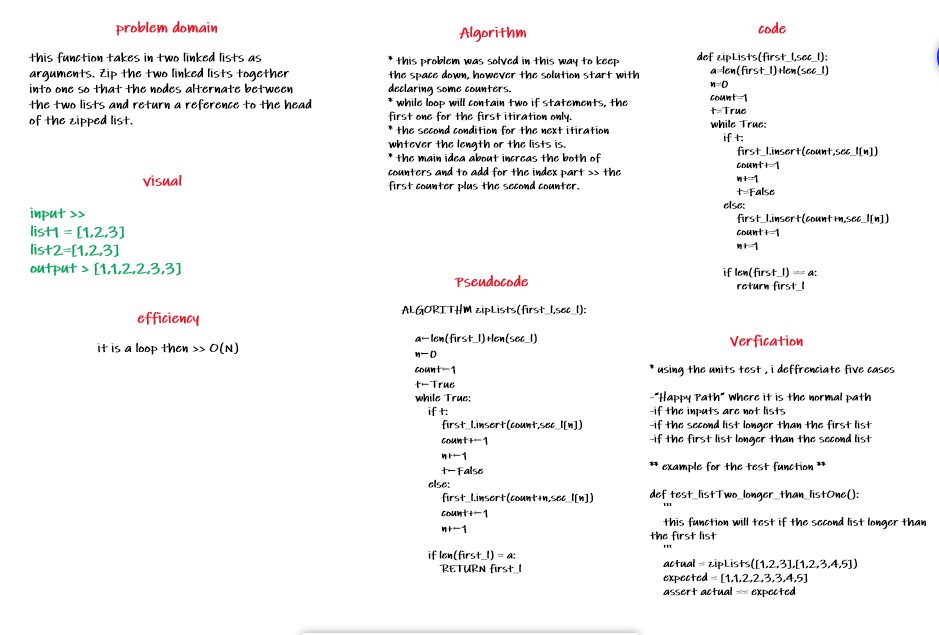

# Linked-list-part4

this function takes in two linked lists as arguments. Zip the two linked lists together into one so that the nodes alternate between the two lists and return a reference to the head of the zipped list.

## Challenge Description

this function which called ll-zip will take in two list and return them as following:
[1,2,3]-[1,2,3] >> [1,1,2,2,3,3]

## Approach & Efficiency

it is a loop then >> O(N)

## Solution

