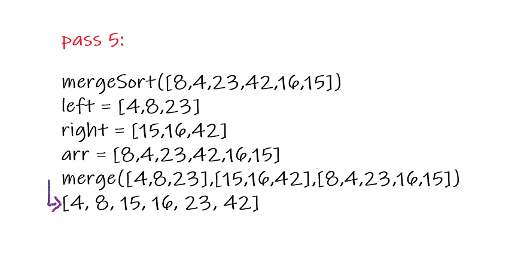

# Insertion Sort

  Pseudocode

    ALGORITHM Mergesort(arr)
        DECLARE n <-- arr.length         
        if n > 1
        DECLARE mid <-- n/2
        DECLARE left <-- arr[0...mid]
        DECLARE right <-- arr[mid...n]
        // sort the left side
        Mergesort(left)
        // sort the right side
        Mergesort(right)
        // merge the sorted left and right sides together
        Merge(left, right, arr)

    ALGORITHM Merge(left, right, arr)
        DECLARE i <-- 0
        DECLARE j <-- 0
        DECLARE k <-- 0

        while i < left.length && j < right.length
            if left[i] <= right[j]
                arr[k] <-- left[i]
                i <-- i + 1
            else
                arr[k] <-- right[j]
                j <-- j + 1
                
            k <-- k + 1

        if i = left.length
        set remaining entries in arr to remaining values in right
        else
        set remaining entries in arr to remaining values in left

## itirations

> Sample array : [8,4,23,42,16,15]

### first itiration

in the first itiration the array would be divided into left and right sides, then the recursion would divide the right of the left array into another left and right. after that it will call the merge function and it will send the parameters as [8],[23],[4,23]. the merge function will sort it but in this itiration it is alreadey sorted.

### second itiration

in the second itiration the array would be divided into left and right sides, then the recursion would divide the left array into another left and right. after that it will call the merge function and it will send the parameters as [8],[4,23],[8,4,23]. the merge function will sort it to [4,8,23].

### third itiration

in the third itiration the array would be divided into left and right sides, then the recursion would divide the right of the right array into another left and right. after that it will call the merge function and it will send the parameters as [16],[15],[16,15]. the merge function will sort it to [15,16].

### fourth itiration

in the fourth itiration the array would be divided into left and right sides, then the recursion would divide the right array into another left and right. after that it will call the merge function and it will send the parameters as [42],[15,16],[42,16,15]. the merge function will sort it to [15,16,42].

### fifth itiration

in the fifth itiration the array would be divided into left and right sides. after that it will call the merge function and it will send the parameters as [4,8,23],[15,16,42],[8,4,23,42,16,15]. the merge function will sort it to [4,8,15,16,23,42].

### Efficency

Time: O(nlogn)

Space: O(n)
