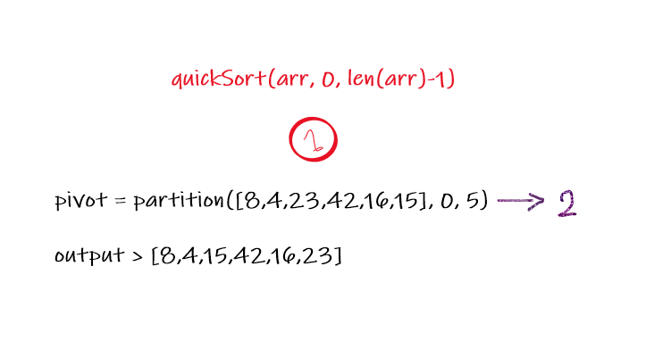
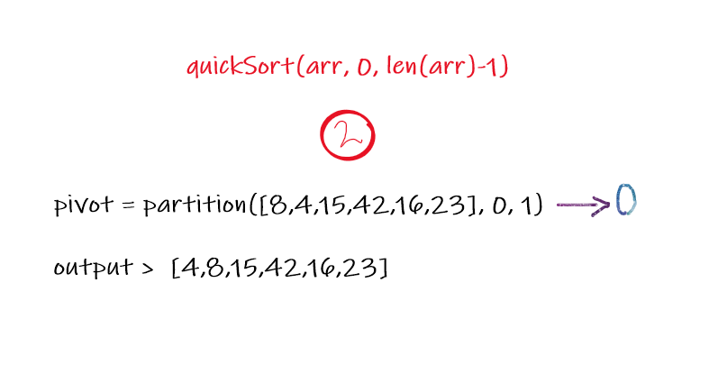
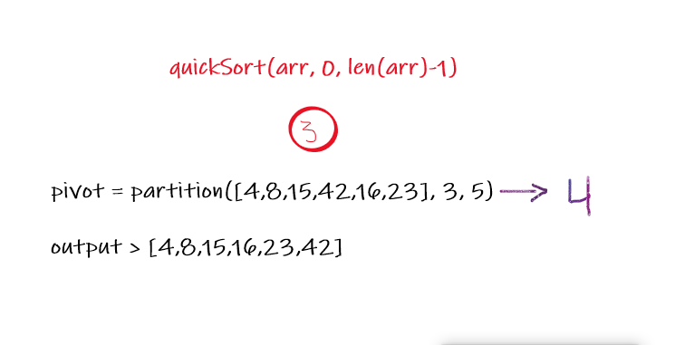

# Insertion Sort

  Pseudocode
  
    ALGORITHM QuickSort(arr, left, right)
    if left < right
        // Partition the array by setting the position of the pivot value 
        DEFINE position <-- Partition(arr, left, right)
        // Sort the left
        QuickSort(arr, left, position - 1)
        // Sort the right
        QuickSort(arr, position + 1, right)

    ALGORITHM Partition(arr, left, right)
        // set a pivot value as a point of reference
        DEFINE pivot <-- arr[right]
        // create a variable to track the largest index of numbers lower than the defined pivot
        DEFINE low <-- left - 1
        for i <- left to right do
            if arr[i] <= pivot
                low++
                Swap(arr, i, low)

        // place the value of the pivot location in the middle.
        // all numbers smaller than the pivot are on the left, larger on the right. 
        Swap(arr, right, low + 1)
        // return the pivot index point
        return low + 1

    ALGORITHM Swap(arr, i, low)
        DEFINE temp;
        temp <-- arr[i]
        arr[i] <-- arr[low]
        arr[low] <-- temp

## itirations

> Sample array : [8,4,23,42,16,15]

### first itiration

in the first itiration the partition function will be called with the parameters > arr , left=0 , right=5. and it will return pivot = 2. with a partial sorted array [8,4,15,42,16,23].

### second itiration 

in the second itiration the quickstart function will be called recursively. as quickSort([8,4,15,42,16,23], 0, 1) that will recall the partition function and in this itiration it will return pivot = 0, with a partial sorted array [4,8,15,42,16,23].

### third itiration 

in the third itiration the quickstart function will be called recursively. as quickSort([4,8,15,42,16,23], 3, 5) that will recall the partition function and in this itiration it will return pivot = 4, with sorted array 
[4,8,15,16,23,42].

* there another itiration but since the array is already sorted it will not affect anything. however, it will return pivot = 5.

### Efficency

Time: O(n2)
Space: O(1)
