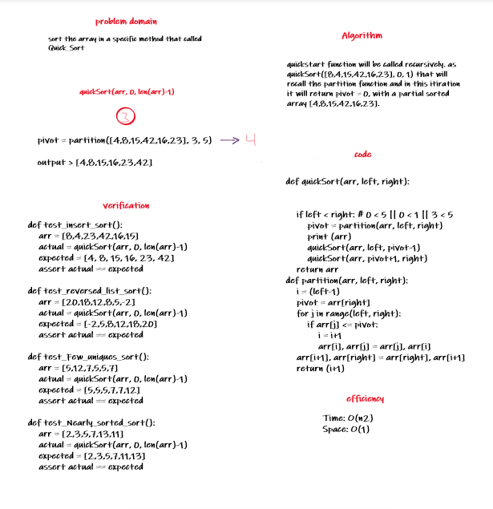

# Merge sort

this function takes in the array and return it sorted using quick sort algorithm.

## Challenge Description

[8,4,23,42,16,15] >> [4,8,15,16,23,42]

## Approach & Efficiency

Time: O(n2)
Space: O(1)

## Solution

