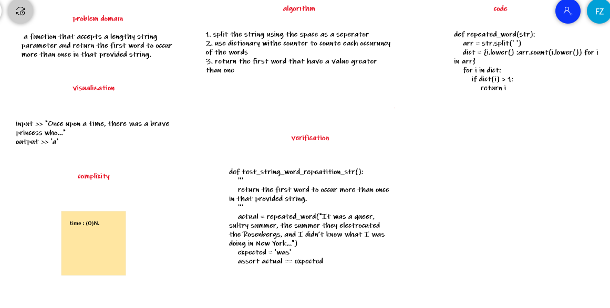

# Repeated word

 a function that accepts a lengthy string parameter and return the first word to occur more than once in that provided string.

## Challenge Description

input >> "Once upon a time, there was a brave princess who..."
output >> 'a'

## Approach & Efficiency

it is a loop then >> O(N)

## Solution

