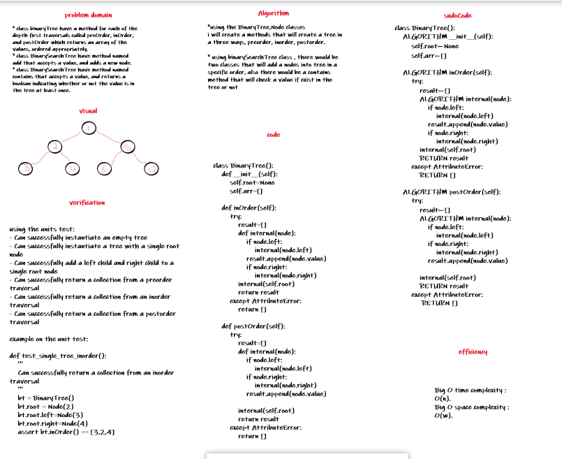

# Trees

* class binaryTree have a method for each of the depth first traversals called preOrder, inOrder, and postOrder which returns an array of the values, ordered appropriately.
* class BinarySearchTree have method named add that accepts a value, and adds a new node.
* class BinarySearchTree have method named contains that accepts a value, and returns a boolean indicating whether or not the value is in the tree at least once.

#### tree Visualization:

## Challenge Description

the test will be like following:

- [x] Can successfully instantiate an empty tree
- [x] Can successfully instantiate a tree with a single root node
- [x] Can successfully add a left child and right child to a single root node
- [x] Can successfully return a collection from a preorder traversal
- [x] Can successfully return a collection from an inorder traversal
- [x] Can successfully return a collection from a postorder traversal

## Approach & Efficiency

Big O time complexity : O(n).
Big O space complexity : O(w).

## Solution

