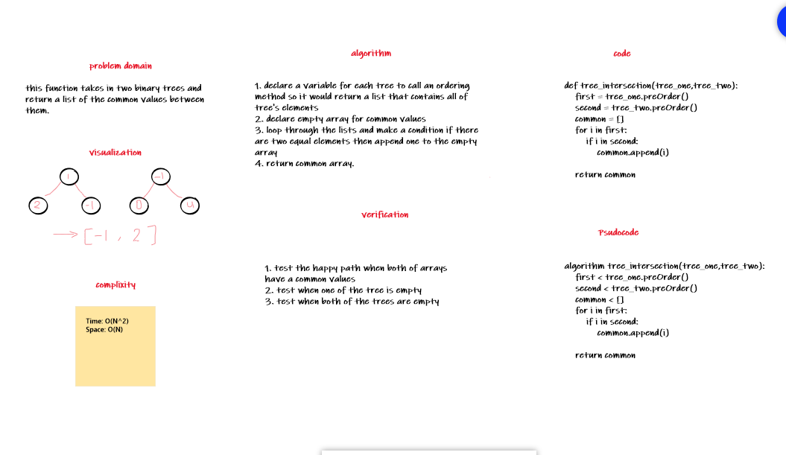

# tree_intersection

this function takes in two binary trees and return a list of the common values between them.

## Challenge Description

[0,4,2], [4,2,1] >> [4,2]

## Approach & Efficiency

Time: O(N^2)
Space: O(N)

## Solution

