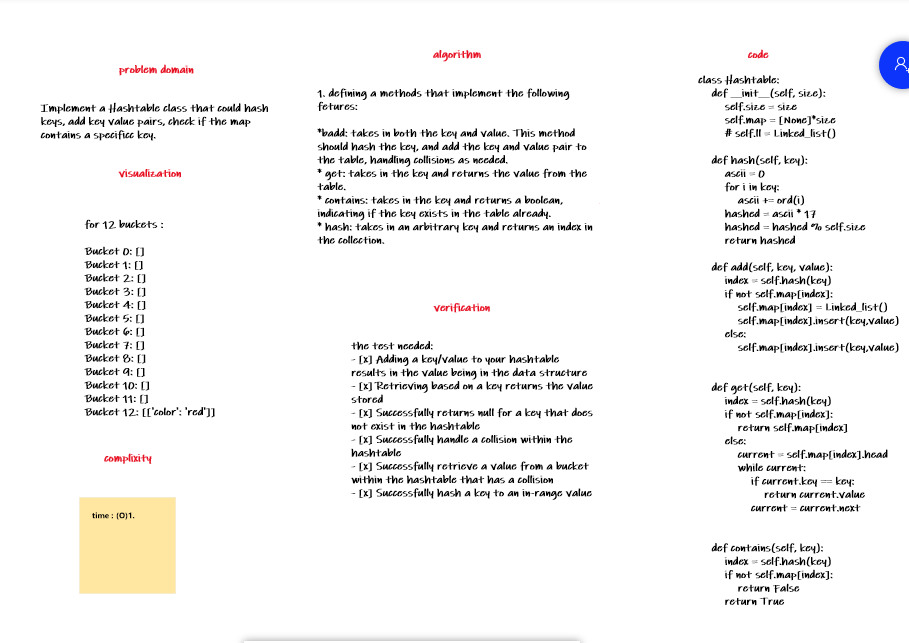

# Hash Tables

Implementing a Hashtable with the following methods:

add: takes in both the key and value. This method should hash the key, and add the key and value pair to the table, handling collisions as needed.
get: takes in the key and returns the value from the table.
contains: takes in the key and returns a boolean, indicating if the key exists in the table already.
hash: takes in an arbitrary key and returns an index in the collection.

## Challenge Description

the tests will be like following:

- [x] Adding a key/value to your hashtable results in the value being in the data structure
- [x] Retrieving based on a key returns the value stored
- [x] Successfully returns null for a key that does not exist in the hashtable
- [x] Successfully handle a collision within the hashtable
- [x] Successfully retrieve a value from a bucket within the hashtable that has a collision
- [x] Successfully hash a key to an in-range value

## Approach & Efficiency

time: O(1)

## Solution

