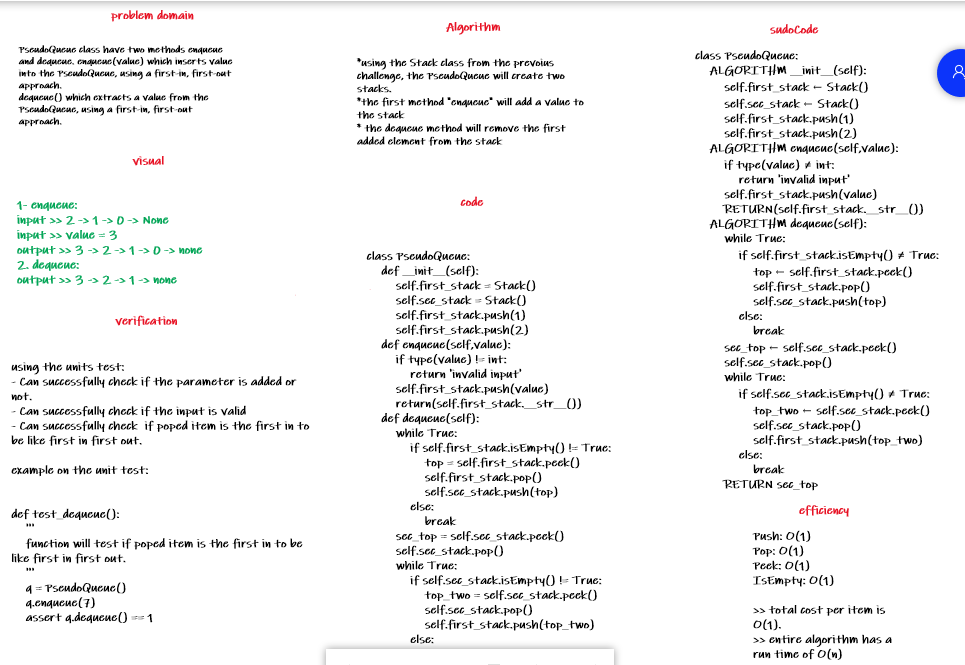

# Stacks and Queues 2

PseudoQueue class have two methods enqueue and dequeue. enqueue(value) which inserts value into the PseudoQueue, using a first-in, first-out approach.
dequeue() which extracts a value from the PseudoQueue, using a first-in, first-out approach.

## Challenge Description

the test will be like following:

- [x] inserts value into the PseudoQueue, using a first-in, first-out approach.
- [x] extracts a value from the PseudoQueue, using a first-in, first-out approach.

## Approach & Efficiency

using the methods from Stack class which have the following comlexity:
Push: O(1)
Pop: O(1)
Peek: O(1)
IsEmpty: O(1)

>> total cost per item is O(1).
>> entire algorithm has a run time of O(n)

## Solution

