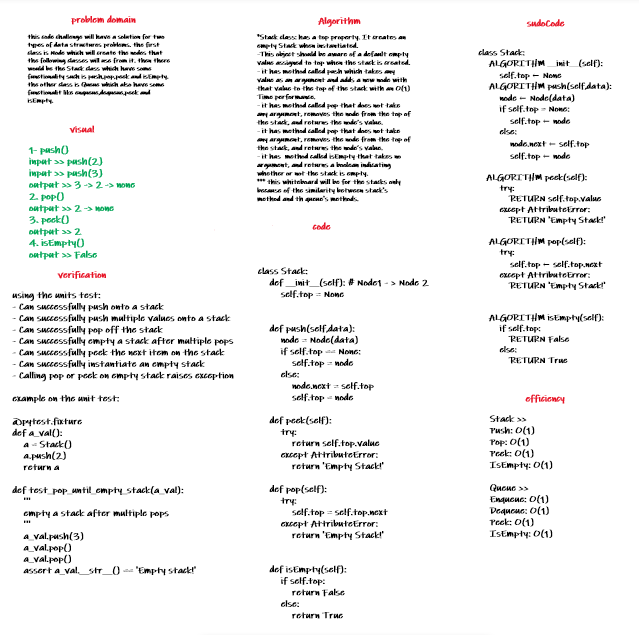

# Stacks and Queues

these are two types of data structures. the first class is Node which will create the nodes that the following classes will use from it. then there would be the Stack class which have some functionality such is push,pop,peek and isEmpty. the other class is Queue which also have some functionalit like enqueue,dequeue,peek and isEmpty.

#### Stack Visualization:

#### Queue Visualization:

## Challenge Description

the test will be like following:
- [x] Can successfully push onto a stack
- [x] Can successfully push multiple values onto a stack
- [x] Can successfully pop off the stack
- [x] Can successfully empty a stack after multiple pops
- [x] Can successfully peek the next item on the stack
- [x] Can successfully instantiate an empty stack
- [x] Calling pop or peek on empty stack raises exception
- [x] Can successfully enqueue into a queue
- [x] Can successfully enqueue multiple values into a queue
- [x] Can successfully dequeue out of a queue the expected value
- [x] Can successfully peek into a queue, seeing the expected value
- [x] Can successfully empty a queue after multiple dequeues
- [x] Can successfully instantiate an empty queue
- [x] Calling dequeue or peek on empty queue raises exception

## Approach & Efficiency

#### *Stack*

Push: O(1)
Pop: O(1)
Peek: O(1)
IsEmpty: O(1)

#### *Queue*

Enqueue: O(1)
Dequeue: O(1)
Peek: O(1)
IsEmpty: O(1)

## Solution

